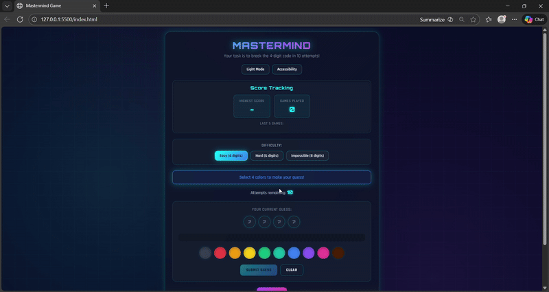

# Mastermind-Game-IEC-Competition-2025

A modern, web-based implementation of the classic Mastermind code-breaking game, built as part of the Ontario Tech Internal Engineering Competition (IEC) 2025.
This project was developed collaboratively by a team of four and achieved 🥈 2nd place in the Programming category.
The goal was to design an engaging, accessible, and competitive game experience under time constraints, while maintaining clean logic and a polished user interface.

## 📦 Technologies
- HTML
- CSS (custom animations, glassmorphism, responsive design)
- JavaScript

## 💡Features
Here’s what you can do with the Mastermind Game:

### 🎯 Play the Classic Mastermind Game
- Crack a hidden numeric code within a limited number of attempts
*   Receive accurate feedback after each guess:
    *   Black pegs → correct number & correct position
    *   White pegs → correct number, wrong position

### 🔢 Multiple Difficulty Levels
- Easy – 4-digit code
- Hard – 6-digit code
- Impossible – 8-digit code
- Each difficulty adjusts the code length and number of allowed attempts.

### 🌙 Dark / Light Mode
- Toggle between dark and light themes for visual comfort
- Theme choice updates the entire UI dynamically

### ♿ Accessibility Mode
- Displays numeric labels on color pegs
- Designed to support color-blind users and inclusive gameplay

### 📊 Score Tracking
*   Tracks:
    *   Highest score (fewest attempts)
    *   Total games played
    *   Last 5 game results
- Encourages replayability and performance improvement

### 🧾 Guess History: 
- Displays previous guesses with visual feedback
- Helps players reason about patterns and refine strategies

### 📱 Responsive Design:
- Works smoothly on desktop, tablet, and mobile devices interactions

## 👩🏽‍🍳 The Process
We started by defining the core Mastermind logic, focusing on correctness and fairness. The most critical part was implementing the two-pass evaluation algorithm to accurately score black and white pegs without double-counting.
Once the logic was stable, we shifted attention to state management; tracking guesses, attempts, difficulty changes, wins/losses, and score history, all without relying on external libraries.
From there, we designed the UI with a strong focus on:
- Clarity of feedback
- Accessibility
- Visual engagement
Features like dark/light mode, accessibility toggles, and score tracking were added to elevate the project beyond a basic game implementation and make it competition-ready.
Finally, we tested the game across different difficulties, screen sizes, and edge cases to ensure consistent behavior and a smooth user experience.

## 🚦Running the Project
To run the project locally:
1. Clone the repository to your local machine.
2. Open the project folder.
3. Open index.html in your browser.

## 📚 What We Learned
This project reinforced both technical and collaborative skills.

### 🧠 Game Logic & Algorithms
Implemented a non-trivial Mastermind scoring algorithm
Learned how to prevent duplicate matches using array copies and multi-pass evaluation

### 🔄 State Management Without Frameworks
Managed complex game state manually using vanilla JavaScript
Coordinated UI updates with game logic cleanly and predictably

### ♿ Accessibility & UX Design
Gained experience designing features for inclusive gameplay
Learned how small UI decisions significantly affect usability

### 🎨 UI/UX & Frontend Polish
Improved CSS skills with animations, transitions, and responsive layouts
Designed a visually appealing interface under competition time constraints

### 🤝 Team Collaboration
Worked effectively in a team environment
Balanced responsibilities between logic, UI, testing, and refinement

## 🍿 Video Demo
### 🎥 Gameplay Walkthrough
This video demonstrates the full gameplay experience, including:
- Difficulty selection
- Guess submission and feedback
- Dark / Light mode toggle
- Accessibility mode
- Score tracking and win/loss scenarios

  

